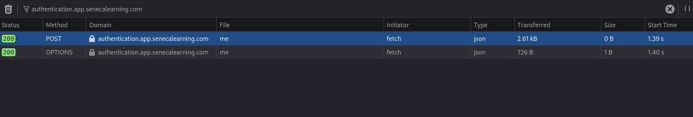
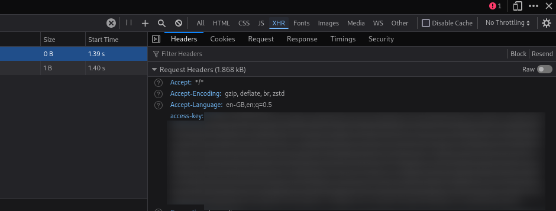

# Seneca Solver

A simple python script that automatically solves your assignments in Seneca (and also gets you a bunch of free XP 🔥). Note that this is still very early in development and may (read: will) have bugs.

It should work on most assignments but probably will not complete every single one. This is due to the fact that not all question types are supported at the moment, although this is currently being worked on. In addition, it **will not work** on the AI-marked "Exam Questions" at the end of assignments. There is very little that can be done about that since that's marked on Seneca's servers.

## How to set up

### Method 1: Executable (recommended)

Download the executable from the releases page to the side, making sure to download the latest release. If on a UNIX-based system (i.e. not using Windows or TempleOS), add the execute permission to the executable using `chmod +x <name-of-executable>`. Move on to the "Usage" section below. If your OS/system architecture is unsupported, use Method 2.

### Method 2: Run the code directly

#### Requirements

You must have the following installed:

- Python >=3.6

#### Steps

1. Run `pip install requests` to install requests if you don't already have it installed.

1. Download the `seneca-solver.py` file to somewhere convenient.

## How to use

1. If you're using the executable, run it. It should open a terminal window.
    - If you're using the python script directly, open a terminal where the script is located and run `python seneca-solver.py`

1. At this point it should be asking for an access key. Here's how to obtain one:
    1. Go to the Seneca dashboard page in your browser and open the inspect menu.
    1. Navigate to the Network tab.
    1. Reload the page. Requests should start appearing in the Network tab.
    1. There should be a filter bar to filter the URLs. Type `authentication.app.senecalearning.com` into the filter bar.
    
    1. Select the latest `POST` request displayed (example: selected request in image above) to view its headers.
    1. In the info panel that opens, scroll down to "Request Headers". This might have a different name in your browser.
    1. Copy the value of the HTTP header named `access-key` (making sure to copy the whole thing) and paste it into the script.
    

1. The script should now start solving your assignments. This may take up to 15 minutes. Also note that your access key will expire every hour, meaning you will need to repeat this process. Using refresh tokens instead of access keys is on the To Do list.
